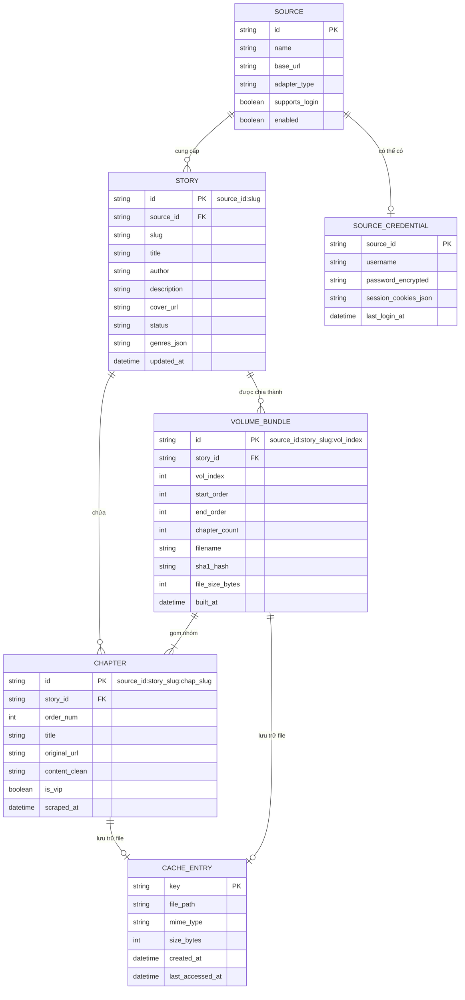
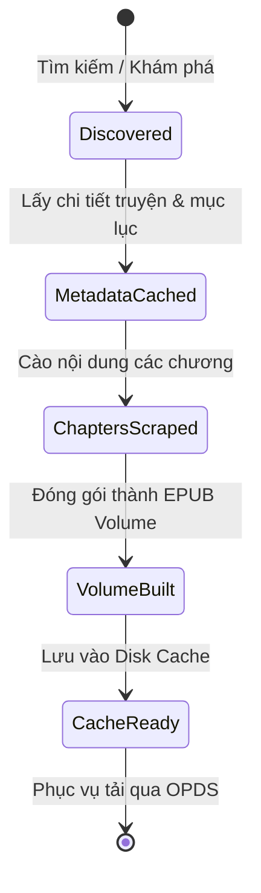

# Data Model Specification: Z-Truyen X3

**Feature**: `001-z-truyen-x3`  
**Date**: 2026-08-18  
**Status**: Draft  

---

## 1. Sơ Đồ Thực Thể & Mối Quan Hệ (ER Diagram)

---

## 2. Chi Tiết Các Thực Thể (Entity Definitions)

### 2.1. `Source`
- **Mục đích**: Đại diện cho 1 nguồn cào truyện (Adapter).
- **Trường dữ liệu**:
  - `id` (string, PK): Mã định danh duy nhất (ví dụ: `storyaclick`, `akaytruyen`, `conduongbachu`).
  - `name` (string): Tên hiển thị (ví dụ: "Storya", "Akay Truyện", "Con Đường Bá Chủ").
  - `base_url` (string): Địa chỉ trang chủ gốc.
  - `adapter_type` (string): Loại bóc tách (`json_api`, `laravel_html`, `wp_json`).
  - `supports_login` (boolean): Có hỗ trợ đăng nhập tài khoản VIP không.
  - `enabled` (boolean): Trạng thái bật/tắt nguồn.

---

### 2.2. `Story`
- **Mục đích**: Đại diện cho 1 tác phẩm/bộ truyện.
- **Trường dữ liệu**:
  - `id` (string, PK): Mã định danh tổng hợp `"{source_id}:{slug}"`.
  - `source_id` (string, FK): Khóa ngoại tham chiếu `Source.id`.
  - `slug` (string): Slug chuẩn hóa trên web nguồn.
  - `title` (string): Tiêu đề truyện tiếng Việt.
  - `author` (string): Tên tác giả (mặc định "Đang cập nhật" nếu không rõ).
  - `description` (string): Văn bản tóm tắt nội dung truyện (loại bỏ HTML độc hại).
  - `cover_url` (string): Đường dẫn ảnh bìa gốc hoặc đường dẫn ảnh đã chuẩn hóa trong cache.
  - `status` (string): Tình trạng ("Hoàn thành", "Đang cập nhật").
  - `genres` (list[string]): Danh sách thể loại (Linh Dị, Tiên Hiệp, Huyền Huyễn...).
  - `total_chapters` (int): Tổng số chương ghi nhận được.
  - `updated_at` (datetime): Thời điểm cập nhật metadata gần nhất.

---

### 2.3. `Chapter`
- **Mục đích**: Đại diện cho 1 chương truyện cụ thể.
- **Trường dữ liệu**:
  - `id` (string, PK): `"{source_id}:{story_slug}:{chap_slug}"`.
  - `story_id` (string, FK): Khóa ngoại tham chiếu `Story.id`.
  - `order_num` (int): Số thứ tự chương (bắt đầu từ 1).
  - `title` (string): Tiêu đề chương (ví dụ: "Chương 1: Khởi đầu").
  - `original_url` (string): Link web gốc của chương.
  - `content_clean` (string): Nội dung văn bản chương dạng XHTML sạch (chỉ chứa các thẻ `
` và ` `).
  - `is_vip` (boolean): Chương có yêu cầu tài khoản VIP không.
  - `scraped_at` (datetime): Thời điểm cào dữ liệu.

---

### 2.4. `VolumeBundle`
- **Mục đích**: Đại diện cho 1 tập truyện đã gom (Volume) được đóng gói thành file EPUB để đọc mượt trên X3.
- **Trường dữ liệu**:
  - `id` (string, PK): `"{source_id}:{story_slug}:v{vol_index:02d}"`.
  - `story_id` (string, FK): Khóa ngoại tham chiếu `Story.id`.
  - `vol_index` (int): Thứ tự tập (1, 2, 3...).
  - `start_order` (int): Chương bắt đầu (ví dụ: 1).
  - `end_order` (int): Chương kết thúc (ví dụ: 50).
  - `chapter_count` (int): Số lượng chương trong tập.
  - `filename` (string): Tên file chuẩn hóa theo quy tắc KOSync: `ztruyen_{source_id}_{story_slug}_v{vol_index:02d}.epub`.
  - `sha1_hash` (string): Mã băm SHA-1 của file EPUB để KOSync định danh.
  - `file_size_bytes` (int): Kích thước file (bytes).
  - `built_at` (datetime): Thời điểm sinh file EPUB.

---

### 2.5. `SourceCredential`
- **Mục đích**: Lưu thông tin đăng nhập vào các nguồn có tài khoản VIP (như AkayTruyen).
- **Trường dữ liệu**:
  - `source_id` (string, PK): Mã nguồn.
  - `username` (string): Tên đăng nhập / Email.
  - `password_encrypted` (string): Mật khẩu đã được mã hóa an toàn.
  - `session_cookies_json` (string): Chuỗi JSON lưu trữ cookie session hiện hành.
  - `last_login_at` (datetime): Thời điểm đăng nhập thành công gần nhất.

---

## 3. Vòng Đời & Trạng Thái Xử Lý (State Transitions)

